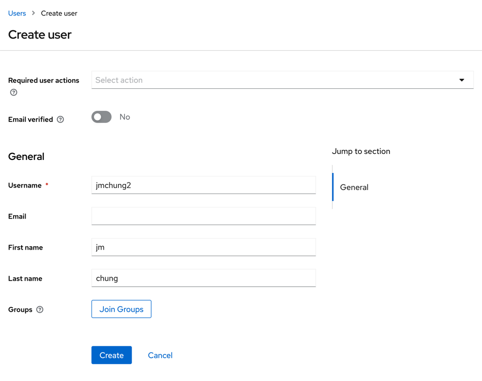
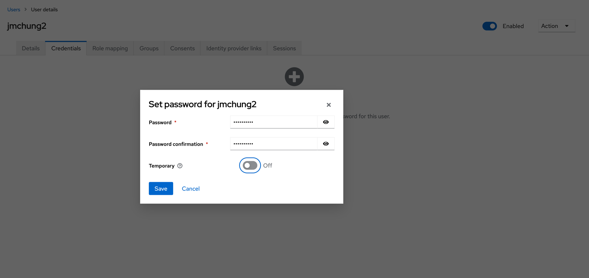
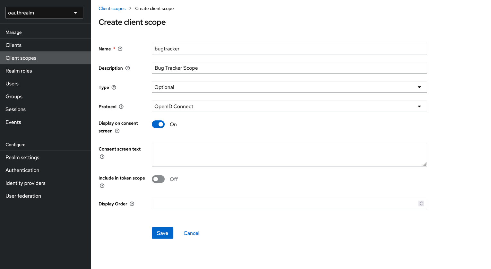
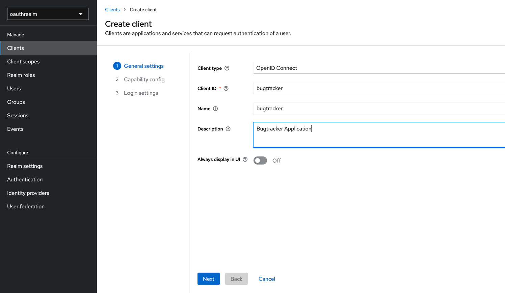
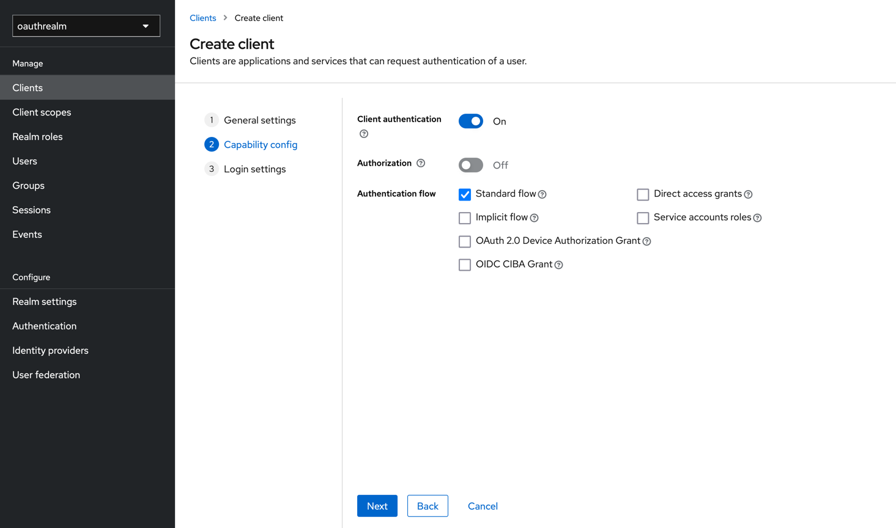
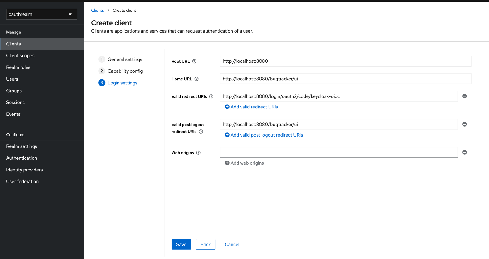

## 1. KeyCloak Setup

```shell
$ cd docker-compose
$ docker-compose up -d
```

1. create a realm
2. select the realm
3. create a user
    1. 
    2. 

4. create client scope
    1. 

5. create client
    1. 
    2. 
        - client authentication: This defines the type of the OIDC client. When it's ON, the OIDC type is set to
          confidential access type. When it's OFF, it is set to public access type.
        - Authorization: Enable/Disable fine-grained authorization support for a client
        - Authentication Flow
            - Standard Flow: This enables standard OpenID Connect redirect based authentication with authorization code.
              In terms of OpenID Connect or OAuth2 specifications, this enables support of 'Authorization Code Flow' for
              this client.
            - Direct access grants: This enables support for Direct Access Grants, which means that client has access to
              username/password of user and exchange it directly with Keycloak server for access token. In terms of
              OAuth2 specification, this enables support of 'Resource Owner Password Credentials Grant' for this client.
            - Implicit Flow: This enables support for OpenID Connect redirect based authentication without authorization
              code. In terms of OpenID Connect or OAuth2 specifications, this enables support of 'Implicit Flow' for
              this client.
            - Service Accounts roles: Allows you to authenticate this client to Keycloak and retrieve access token
              dedicated to this client. In terms of OAuth2 specification, this enables support of 'Client Credentials
              Grant' for this client.
            - oAuth 2.0. Device Authorization Grant: This enables support for OAuth 2.0 Device Authorization Grant,
              which means that client is an application on device that has limited input capabilities or lack a suitable
              browser.
            - OIDC CIBA Grant: This enables support for OIDC CIBA Grant, which means that the user is authenticated via
              some external authentication device instead of the user's browser.
    3. 
